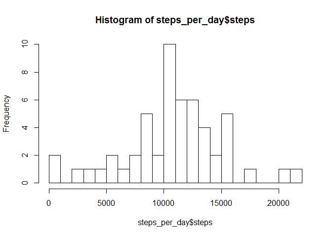
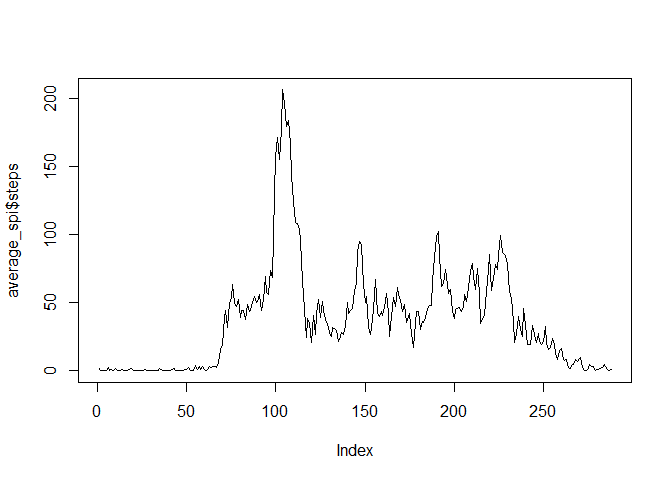
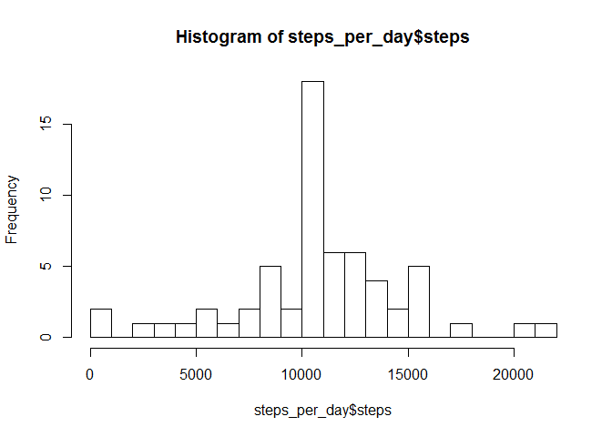
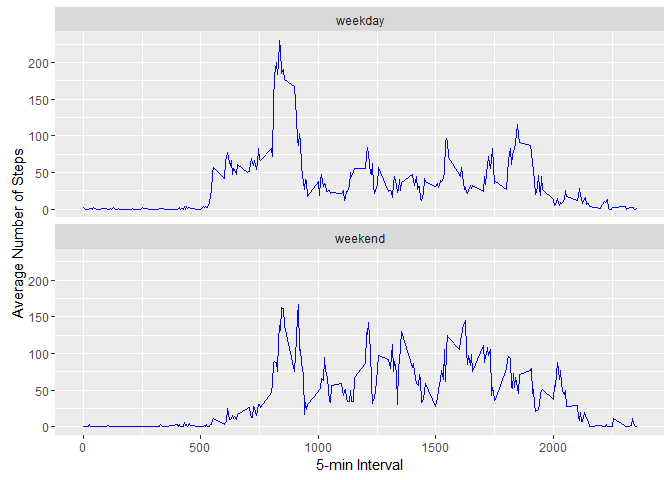

# Reproducible Research: Peer Assessment 1


## Loading and preprocessing the data
To load the data, you need to first download [the activity dataset][1] and then unzip it and put it in your working directory. After that run the following code:


```r
activity <- read.csv(file = "activity.csv")
activity$date <- as.Date(activity$date, "%Y-%m-%d")
```

```
## Warning in strptime(x, format, tz = "GMT"): unable to identify current timezone 'M':
## please set environment variable 'TZ'
```

```
## Warning in strptime(x, format, tz = "GMT"): unknown timezone 'localtime'
```

This code loads the data and then coerces the date column from the 'factor' class to the 'dates' class so that we can do date specific calculations.
## What is mean total number of steps taken per day?
For this part of the analysis we ignore the missing values.

The following code creates a histogram of the number of steps taken each day, by first splitting the steps column by date and then averaging over each element of the generated list using sapply:


```r
steps_per_day <- aggregate(steps ~ date, activity, sum, na.rm = T)
hist(steps_per_day$steps, breaks = 20)
```



Mean and median of the total number of steps taken per day:


```r
mean(steps_per_day$steps)
```

```
## [1] 10766.19
```

```r
median(steps_per_day$steps)
```

```
## [1] 10765
```

## What is the average daily activity pattern?
Let's make a time series plot of the 5-minute interval (x-axis) and the average number of steps taken, averaged across all days (y-axis). For this we nedd to calculate the average number of steps over each interval:


```r
average_spi <- aggregate(steps ~ interval, activity, mean, na.rm = T)
plot(average_spi$steps, type = "l")
```



Let's determine the 5-minute interval that, averaged across all days,  contains the maximum number of steps:


```r
activity$interval[which(average_spi == max(average_spi$steps))]
```

```
## [1] 835
```

## Imputing missing values
There are a number of days/intervals where there are missing values (coded as NA). The presence of missing days may introduce bias into some calculations or summaries of the data.

Let's calculate the total number of missing values in the dataset:


```r
sum(is.na(activity$steps))
```

```
## [1] 2304
```

Let's fill in each missing value with the average number of steps of the corresponding interval:


```r
n <- nrow(average_spi)
for (i in 1:n)
{
    l <- (activity$interval == activity$interval[i] & is.na(activity$steps))
    activity$steps[l] <- average_spi$steps[i]
}
```

Now we replot the first histogram and recalculate the mean and median of the number of steps per day using the dataset  with the filled-in missing values.


```r
steps_per_day <- aggregate(steps ~ date, activity, sum)
hist(steps_per_day$steps, breaks = 30)
```



```r
mean(steps_per_day$steps)
```

```
## [1] 10766.19
```

```r
median(steps_per_day$steps)
```

```
## [1] 10766.19
```

Now the mean is exactly equal to the median.

## Are there differences in activity patterns between weekdays and weekends?
To answer this let's create a new factor variable in the dataset with two levels -- "weekday" and "weekend" indicating whether a given date is a weekday or weekend day:


```r
f <- gl(2, 1, 2, c("weekday", "weekend"))
days <- weekdays(activity$date)
l <- days %in% c("Saturday", "Sunday")
activity$day <- f[as.numeric(l) + 1L]
```

Then we calculate the average number of steps per interval for weekdays and weekends and plot them to compare:


```r
interval_spd <- aggregate(steps ~ interval + day, activity, mean, na.rm = T)
library(ggplot2)
```

```
## Warning: package 'ggplot2' was built under R version 3.2.3
```

```r
ggplot(interval_spd, aes(x=interval, y=steps)) + 
  geom_line(color="blue") + 
  facet_wrap(~ day, nrow=2, ncol=1) +
  labs(x="5-min Interval", y="Average Number of Steps")
```



There seems to be more walking done during weekends.

[1]: http://d396qusza40orc.cloudfront.net/repdata%2Fdata%2Factivity.zip
